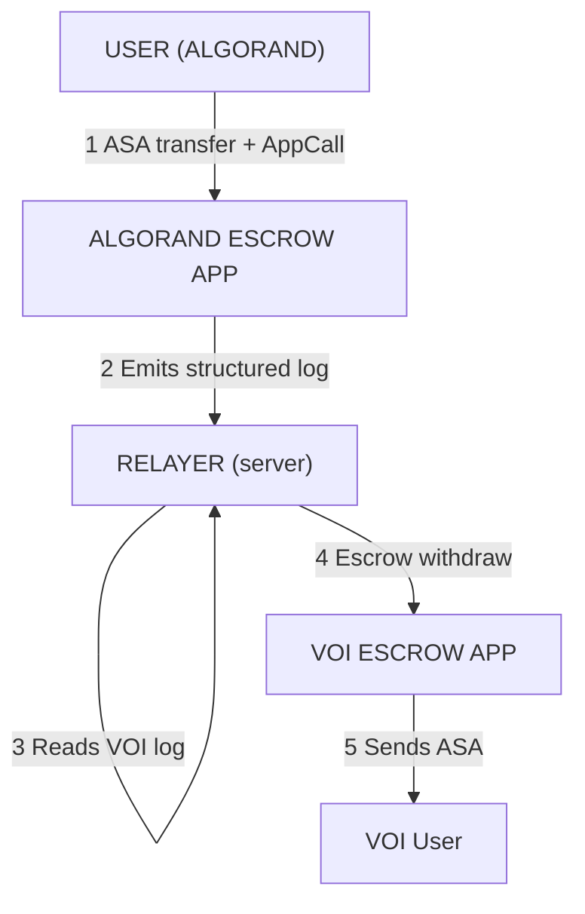

# ALGO-VOI
Algorand to VOI Mainnet Bridge

Coming

```mermaid
flowchart TD
    U["USER (ALGORAND)"]
    VEA["ALGORAND ESCROW APP"]
    R["RELAYER (server)"]
    AEA["VOI ESCROW APP"]
    AU["VOI User"]

    U -->|1 ASA transfer + AppCall| VEA
    VEA -->|2 Emits structured log| R
    R -->|3 Reads VOI log| R
    R -->|4 Escrow withdraw| AEA
    AEA -->|5 Sends ASA| AU
```
